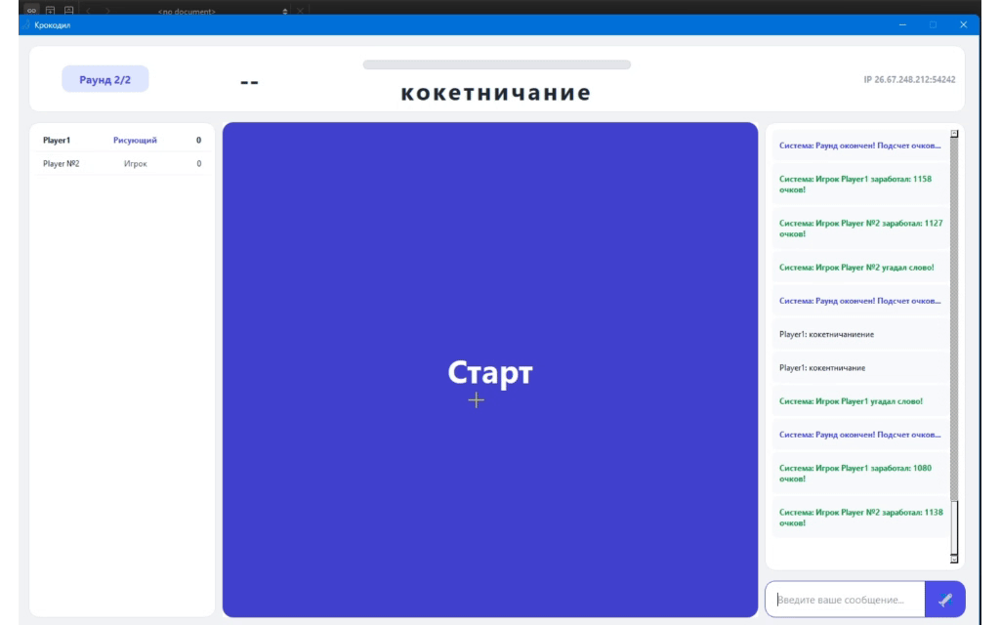
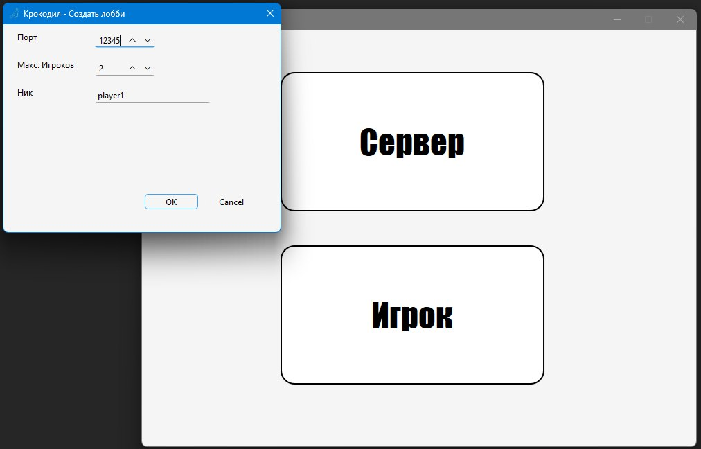
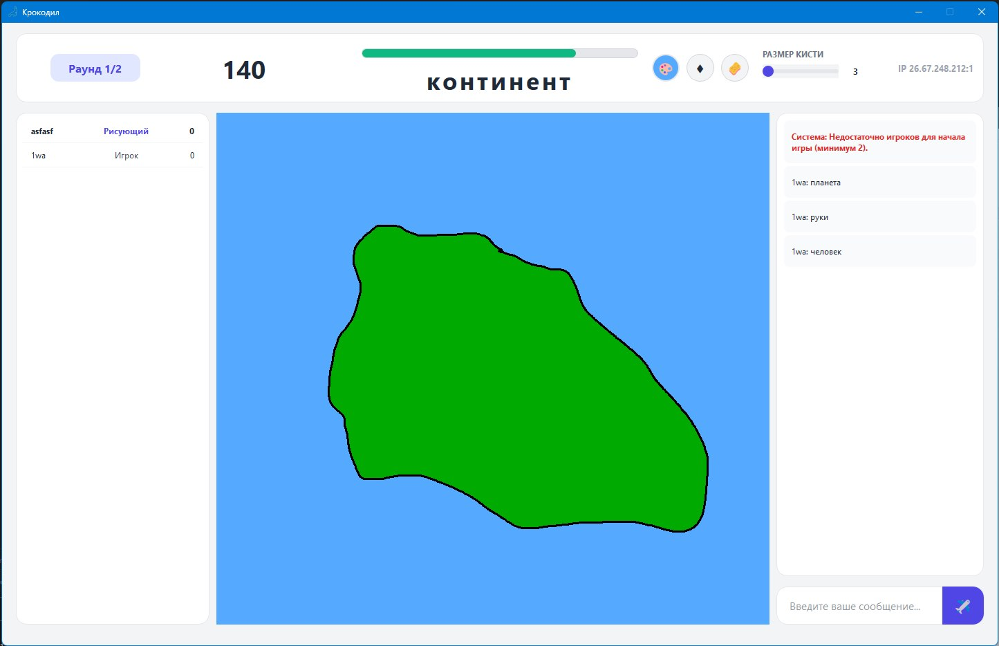

# 🐊 Игра "Крокодил"

>Кроссплатформенное сетевое графическое приложение, в котором игроки угадывают слово, рисуемое ведущим в реальном времени.


## 🛠 Технический стек

* **Язык программирования:** C++
* **Фреймворк:** Qt 6 (GUI, сетевое взаимодействие)
* **Система сборки:** CMake
* **Компиляторы:** GCC, G++
## ✨ Основные возможности

* 🎨 **Интерактивный холст:** Набор инструментов для рисования с синхронизацией и передачей рисунка игрокам в реальном времени.
* 💬 **Текстовый чат:** Встроенный чат для коммуникации и ввода вариантов ответов.
* 🏆 **Автоматический подсчёт очков:** Система начисления баллов игроку за угаданное слово и ведущему за понятный рисунок.
* 💻 **Кроссплатформенность:** Поддержка сборки и стабильная работа под ОС Windows и Linux (Ubuntu).
* 📖 **Богатый выбор слов:** Встроенный словарь на более чем 34 тысячи русских существительных.## 🚀 Установка и сборка

### 🐧 Linux (Ubuntu)

1. **Обновление системы и установка зависимостей:**
   ```bash
   sudo apt update && sudo apt install -y build-essential git cmake qt6-base-dev qt6-tools-dev qt6-tools-dev-tools
2. **Клонирование репозитория:**
    ```bash
    git clone https://github.com/Razil131/crocodile_qt.git
    cd crocodile_qt
3. **Сборка проекта:**
    ```bash
    mkdir build && cd build
    cmake ..
    cmake --build . --parallel $(nproc)

### 🪟 Windows (MSYS2 / MinGW)

1. **Установка MSYS2:**
   ```bash
   winget install MSYS2.MSYS2 --silent --accept-package-agreements
2. **Добавление компилятора в переменные среды (PATH):**
    * Нажмите Win + R → введите sysdm.cpl→ нажмите Enter.
    * Перейдите во вкладку Дополнительно → Переменные среды. 
    * В разделе Системные переменные найдите Path → Изменить → Создать.
    * Добавьте путь: C:\msys64\ucrt64\bin
    * Нажмите ОК во всех окнах и перезагрузите компьютер.
3. **Установка инструментария и Qt6:**
    
    Откройте терминал MSYS2 UCRT64 и выполните:
    ```bash
    pacman -S --noconfirm mingw-w64-ucrt-x86_64-toolchain mingw-w64-ucrt-x86_64-cmake mingw-w64-ucrt-x86_64-qt6-base mingw-w64-ucrt-x86_64-qt6-tools git
4. **Клонирование и сборка:**
    ```bash
    git clone https://github.com/Razil131/crocodile_qt.git
    cd crocodile_qt
    mkdir build && cd build
    cmake -G "MinGW Makefiles" ..
    mingw32-make -j$(nproc)
## 🖥 Системные требования

### Минимальные
* **ОС:** Windows 11 (64-bit) / Ubuntu 25.04 LTS (64-bit)
* **Процессор:** 2-ядерный x86_64 процессор (1.5 GHz+)
* **Оперативная память:** 2 ГБ RAM
* **Видеокарта:** С поддержкой OpenGL 2.1 / DirectX 11
* **Место на диске:** ~150 МБ
* **Сеть:** Подключение к локальной сети (LAN) или Интернет
## 🖼 Демонстрация и скриншоты

### 📽 Процесс игры в реальном времени

*Синхронизация холста и мгновенная отправка сообщений в чат между клиентами.*

---

### 📸 Интерфейс приложения

**Подключение и создание комнаты:**



**Игровой холст и чат:**
